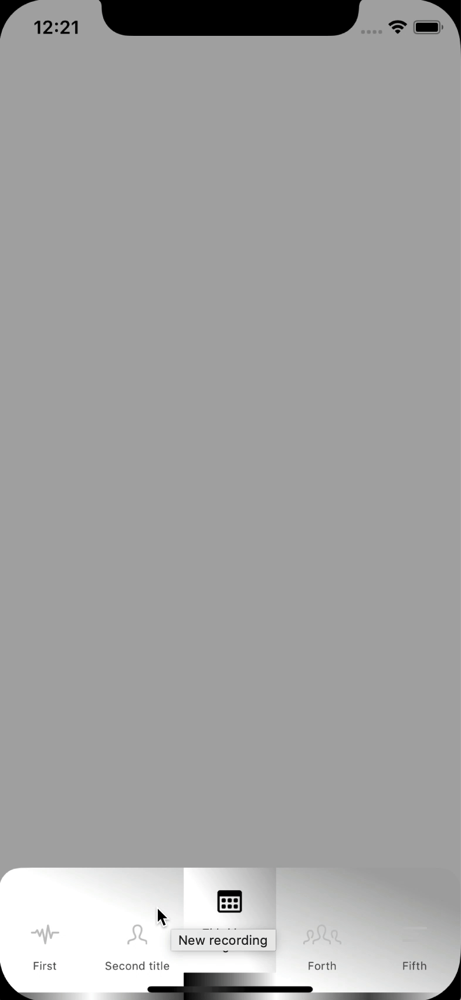
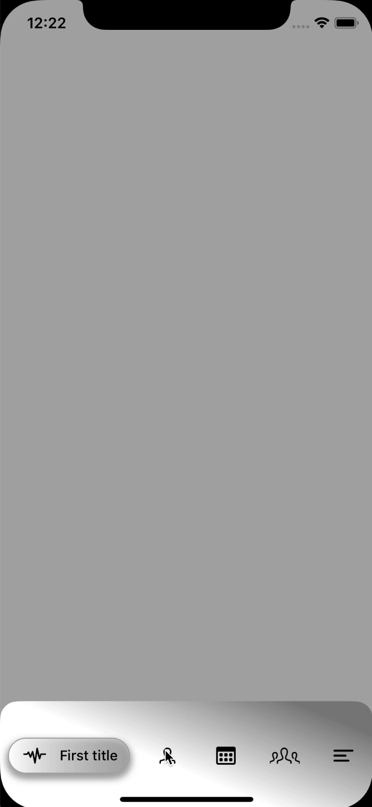

## AnimatedTabBar


Lightweight lib for replacement standard UITabBarController with animated and fully customizable one.

<p align="left">
  
  
  </a>
  <a href="https://github.com/icon-project/ICONKit" target="_blank">
    
  </a>
    <a href="https://github.com/icon-project/ICONKit" target="_blank">
    
  </a>
</p>


<div class="row">
  <div class="column">
	<p align="center">
	  
	  
	</p>
  </div>
</div>


## Installation

### Using [CocoaPods](https://cocoapods.org):

Simply add the following line to your Podfile:

```ruby
pod 'HKAnimatedTabBar'
```

This will download the `HKAnimatedTabBar` binaries and dependencies in `Pods/` during your next
`pod install` execution.

This is the recommended way to install a specific version of CalendarView.


## Usage

* add `UITabbarController` to your interface builder and specify class name `HKAnimatedTabBar`, also update class for `UITabBar`


<p align="center">
  
</p>

Or alternatively create subclass of `AnimatedTabBarController` and/or `AnimatedTabBarView` and configure it:

 ``` swift
import UIKit

final class CustomTabBarController: AnimatedTabBarController {

  // MARK: - Override

  override func configure() {
  
  		// set selected index
    selectedIndex = 2 
    tabBar.replaceView.selectedIndex = selectedIndex
    
    	// configure items
    let items = HightLightableTabBarModel.prepareItems()
    configureFor(items)

		// modify appearence
    tabBar.replaceView.contentContainerShadowColor = UIColor.lightGray
    tabBar.replaceView.contentContainerShadowOpacity = 0.2
    tabBar.replaceView.contentContainerCornerRadius = 18

    tabBar.replaceView.gradientColors = [
      UIColor.white,
      UIColor.white,
      UIColor.gray
    ]
  }
}

 ```

Next step - creating your animated TabBarItems using `AnimatedTabBarItemRepresentable`. Each button must be backed by `AnimatedTabBarItemModel`

 ``` swift
/*
 Represent model for tabBar item

 - Tag: 1000
 - Version: 0.1
 */
public protocol AnimatedTabBarItemModel {

  /// unique identifier of model
  var identifier: String { get }

  /// return view for model, descibed as AnimatedTabBarItemRepresentable, should be inherited from UIView
  var viewRepresentation: AnimatedTabBarItemRepresentable { get }

  /// describe size of item when selected
  var selectedComponentWidth: CGFloat { get }

  /// action which will be triggered when item selected
  var action: ((AnimatedTabBarItemModel) -> ())? { get set }
}
 ```
 

Your model can have more properties that will help you to customize button view - check samples for more.

Protocol `AnimatedTabBarItemRepresentable` represent concrete object (`UIView`) that will be used instead of button on tabBar

 ``` swift
 /*
 View that represent object for tabBar button

 - Tag: 1001
 - Version: 0.1
 */
public protocol AnimatedTabBarItemRepresentable where Self: UIView {

  /// This function called when view is ready to be displayed but not configured yet
  ///  - Parameter item: item that contains current settings for button replacement see [AnimatedTabBarItemModel](x-source-tag://1000)
  func configure(item: AnimatedTabBarItemModel)

  /// This function triggered when user select/deselect tabBar item
  ///  - Parameter selected: indicate current selection state
  ///  - Parameter item: item that contains current settings for button replacement see [AnimatedTabBarItemModel](x-source-tag://1000)
  func switchToSelectedState(_ selected: Bool, item: AnimatedTabBarItemModel)
}
 ```


Next - create items and configure `AnimatedTabBarController`

 ``` swift

// if you don't create subclass of tabBarController - in very first controller that used in tabBar do next

class ViewController: UIViewController {

  override func viewDidLoad() {
    super.viewDidLoad()

	 // find `AnimatedTabBarController `
    if let tabBarController = self.tabBarController as? AnimatedTabBarController {
    // create items for controller
      let items = ExpandableTabItemModel.prepareItems()
    // set items to controller
      tabBarController.configureFor(items)
    }
    
    // some other setup
  }
}

// if you create subclass of `AnimatedTabBarController`, that perform this configuration in subclass
final class CustomTabBarController: AnimatedTabBarController {

  // MARK: - Override

  override func configure() {
    let items = HightLightableTabBarModel.prepareItems()
    configureFor(items)

	// any other config - check samples for more
  }
}
 ```

✅ 
That's it - you done! 

Build and run :)


## TODO

- test


## Requirement

- Xcode 10 or higher
- iOS 11 or higher
- Swift 5 or higher
- [Cocoapods](https://cocoapods.org)

## License

[MIT licensed.](LICENSE)

## Contact

Have a question or an issue about `AnimatedTabBar`? Create an [issue](https://github.com/kirillgorbushko/HKAnimatedTabBar/issues/new)!

If you would like to contribute - just create a pull request.
